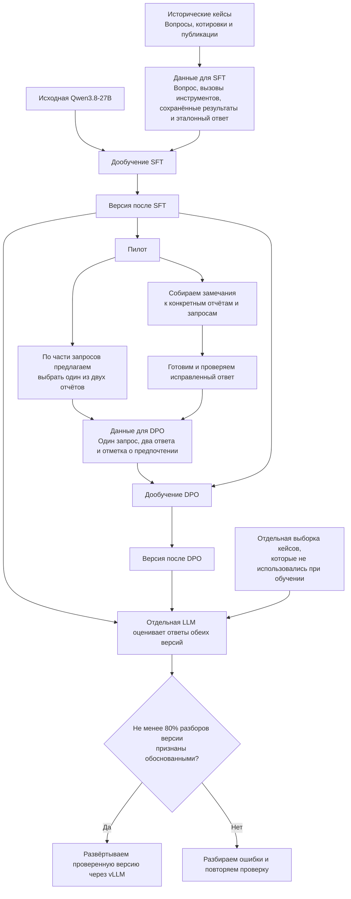

```mermaid
flowchart TD
    H["Исторические кейсы<br/>Вопросы, котировки и публикации"] --> SFTD["Данные для SFT<br/>Вопрос, вызовы инструментов, сохранённые результаты и эталонный ответ"]
    Q["Исходная Qwen3.8-27B"] --> SFT["Дообучение SFT"]
    SFTD --> SFT
    SFT --> V1["Версия после SFT"]

    V1 --> P["Пилот"]
    P --> A["По части запросов предлагаем<br/>выбрать один из двух отчётов"]
    P --> F["Собираем замечания<br/>к конкретным отчётам и запросам"]
    F --> E["Готовим и проверяем исправленный ответ"]
    A --> D["Данные для DPO<br/>Один запрос, два ответа и отметка о предпочтении"]
    E --> D
    D --> DPO["Дообучение DPO"]
    V1 --> DPO
    DPO --> V2["Версия после DPO"]

    V1 --> J["Отдельная LLM оценивает ответы обеих версий"]
    V2 --> J
    T["Отдельная выборка кейсов,<br/>которые не использовались при обучении"] --> J
    J --> G{"Не менее 80% разборов версии<br/>признаны обоснованными?"}
    G -->|"Да"| DEP["Развёртываем проверенную версию через vLLM"]
    G -->|"Нет"| FIX["Разбираем ошибки и повторяем проверку"]
```
